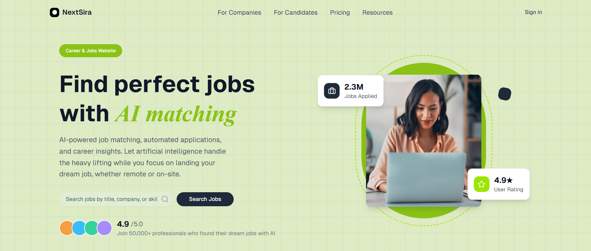
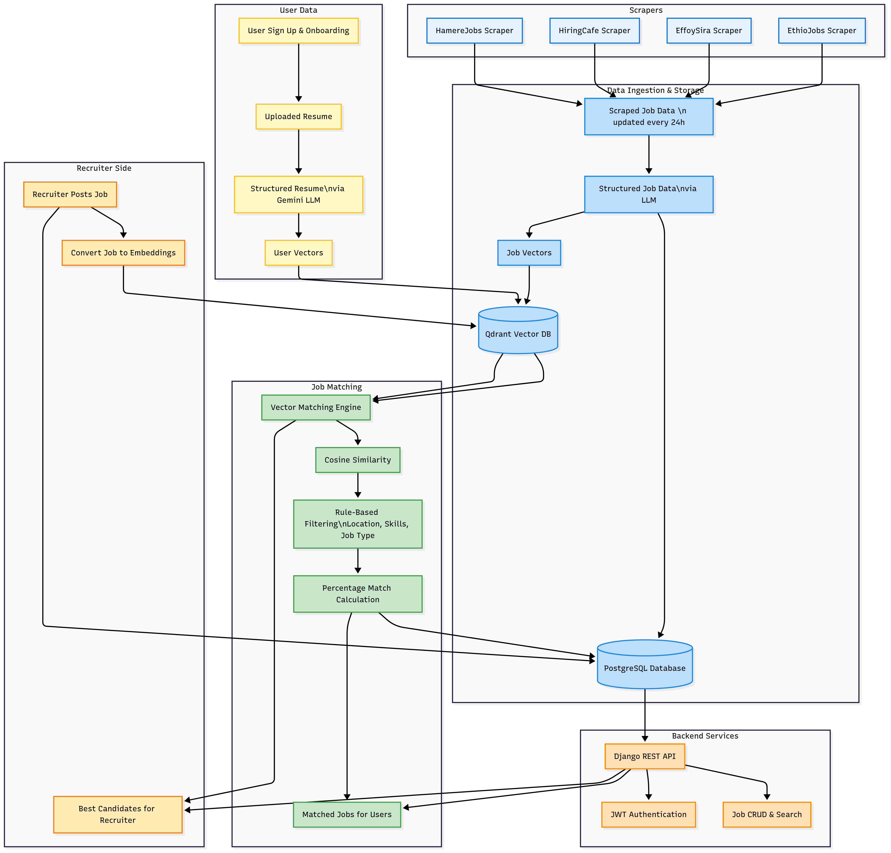

# NextSira – AI-Powered Job Search & Recruiting Platform

### Candidates create a profile → NextSira matches them to jobs (local & remote) → Recruiters post jobs and find top talent.



---

## Overview 🌐

NextSira is an AI-powered job search and recruiting platform for Ethiopia and beyond. It matches candidates to jobs—including remote and international opportunities—optimizes resumes,, and streamlines hiring for recruiters. The platform features a modern Next.js frontend, a Django backend, and advanced matching and analytics for both job seekers and recruiters.

---

## Problem & Solution ⚡

**Problem ❌:** Traditional job boards require manual searching and repetitive applications. Remote job opportunities are often hard to find, and recruiters struggle to efficiently source qualified candidates.

**Solution ✅:** NextSira uses AI to match jobs—including remote and international roles—to candidate profiles, provides resume enhancement and interview prep, and gives recruiters a dashboard to post jobs, review applicants, and manage the hiring process. Jobs are continuously scraped from leading local job sites, ensuring the freshest listings.

---

## Features ✨

- **AI Job Matching 🤖:** Personalized job recommendations based on skills, experience, preferences, and location—including remote jobs.
- **Remote Job Opportunities 🌍:** Discover and apply for remote and international positions alongside local jobs.
- **Resume Optimizer 📄:** Automatically tailor your resume for every job.
- **Recruiter Dashboard 🏢:** Post jobs, view applicants, and manage hiring efficiently.
- **Candidate Management 👥:** Recruiters can filter, rank, and contact top candidates directly.
- **Job Scraping 🔎:** Jobs are automatically collected from major Ethiopian job sites (e.g., EthioJobs, EffoySira) to keep listings up-to-date.

---

## Architecture 🏗️



---

## Tech Stack 🛠️

- **Backend:** Python, Django, Django REST Framework, PostgreSQL, Google Gemini
- **Frontend:** Next.js, React, TypeScript, Tailwind CSS
- **Testing:** Django test framework, Jest + React Testing Library, Cypress

---

## AI Matching, Remote Jobs & Scraping Pipeline 🧠

NextSira uses a robust AI pipeline for job matching and resume optimization, with a special focus on remote opportunities and local job scraping:

- **Profile & Job Embeddings:**  
  Candidate profiles and job postings are converted into vector embeddings using [Sentence Transformers](https://huggingface.co/sentence-transformers/all-MiniLM-L6-v2) ([`backend/job/matching1.py`](backend/backend/job/matching1.py)).

- **Matching Algorithm:**  
  Cosine similarity matches jobs to user profiles, factoring in skills, experience, preferences, location, and remote eligibility.

- **Remote Job Discovery:**  
  The platform highlights remote and international jobs, making it easy for candidates to find flexible work options.

- **Job Scraping:**  
  Jobs are automatically scraped from leading Ethiopian job sites such as EthioJobs and EffoySira ([`scrapers/ethiojobs.py`](scrapers/ethiojobs.py), [`scrapers/effoysira.py`](scrapers/effoysira.py)), ensuring a comprehensive and current job feed.

- **Resume Enhancement:**  
  Uploaded resumes are parsed, scored, and enhanced using Gemini, with actionable suggestions and rendered HTML ([`backend/user/y.py`](backend/backend/user/y.py)).

- **Interview Prep & Salary Insights:**  
  AI generates personalized interview questions and salary negotiation strategies based on your profile and target jobs.

---

### Backend

The backend orchestrates authentication, profile management, job matching, resume enhancement, recruiter tools, and job scraping.

- **User Authentication:**  
  Secure registration, login, JWT-based authentication, and profile management ([`backend/user/views.py`](backend/backend/user/views.py)).

- **Job Management:**  
  CRUD APIs for jobs, recruiter dashboards, job search, and remote job filtering ([`backend/job/views.py`](backend/backend/job/views.py)).

- **Recruiter Tools:**  
  Recruiters can sign up, post jobs (local or remote), view and filter applicants, and manage the hiring process efficiently.

- **Resume & Cover Letter Generation:**  
  AI-powered resume parsing, scoring, and enhancement, plus cover letter generation ([`backend/user/y.py`](backend/backend/user/y.py), [`backend/user/views.py`](backend/backend/user/views.py)).

- **Job Scraping:**  
  Automated scripts regularly update the job database from major local job sites.

---

### Dashboard

The dashboard provides actionable insights and controls for both candidates and recruiters.

- **Candidate Dashboard:**  
  View matched jobs (local & remote), application status, resume scores, and interview prep.

- **Recruiter Dashboard:**  
  Post jobs (local or remote), view applicants, filter and rank candidates, and manage hiring from a single interface.

- **Analytics:**  
  Track job matches, application outcomes, resume improvements, and hiring metrics.

---

## Project Structure

```plaintext
backend/
  backend/
    job/
    user/
    ...
frontend/
  app/
  components/
  hooks/
  lib/
scrapers/
  effoysira.py
  ethiojobs.py
.env
```

---

## Setup ⚡

### Backend

```sh
cd backend
python -m venv venv
source venv/bin/activate
pip install -r requirements.txt
cp .env.example .env
python manage.py migrate
python manage.py runserver
```

### Frontend

```sh
cd frontend
npm install
npm run dev
```

---

## API Reference

- **Auth:**
  - `/api/user/register/`
  - `/api/user/token/`
  - `/api/user/token/refresh/`

- **Jobs:**
  - `/api/job/feed/`
  - `/api/job/details/<id>/`
  - `/api/job/apply/<id>/`
  - `/api/jobs/match_all/`
  - `/api/jobs/search/`

- **Profile:**
  - `/api/user/profile/`
  - `/api/user/onboarding/`
  - `/api/user/enhance-resume/`
  - `/api/user/enhance-user-resume/`
  - `/api/user/generate-cover-letter/`

- **Recruiter:**
  - `/api/user/recruiter_onboarding/`
  - `/api/job/recruiter_jobs/`
  - `/api/job/create_job/`

---

## Scrapers

Job scrapers are in `scrapers/` and can be run independently to update job data from local Ethiopian job sites and other sources.


## Roadmap / Unique Features 🚀

- Recruiter Tools 🏢: Talent pool analytics, candidate ranking, and communication.
- Multi-language Support 🌐: Automatic translation for global jobs.
- Remote Job Expansion 🌍: More international and remote job sources.
- AI Interview Coach 🤖: Real-time interview simulation and feedback.

---

## License 📄

MIT — see LICENSE
